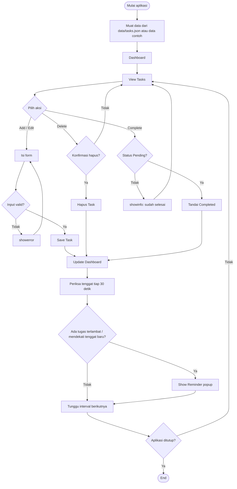

# Flowchart — Smart To-Do with Reminders

```mermaid
flowchart TD
    A([Mulai aplikasi]) --> B[Muat data dari data/tasks.json atau data contoh]
    B --> C[Dashboard]
    C --> D[View Tasks]
    D --> E{Pilih aksi}
    E -->|Add / Edit| F[Isi form]
    E -->|Delete| G{Konfirmasi hapus?}
    E -->|Complete| H{Status Pending?}
    F --> I{Input valid?}
    I -->|Tidak| J[showerror] --> F
    I -->|Ya| K[Save Task]
    G -->|Ya| K2[Hapus Task]
    G -->|Tidak| D
    H -->|Ya| K3[Tandai Completed]
    H -->|Tidak| L[showinfo: sudah selesai] --> D
    K --> M[Update Dashboard]
    K2 --> M
    K3 --> M
    M --> N[Periksa tenggat tiap 30 detik]
    N --> O{Ada tugas terlambat / mendekati tenggat baru?}
    O -->|Ya| P[Show Reminder popup]
    O -->|Tidak| Q[Tunggu interval berikutnya]
    P --> Q
    Q --> R{Aplikasi ditutup?}
    R -->|Tidak| D
    R -->|Ya| S([End])
```
